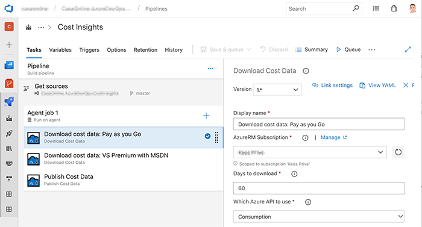
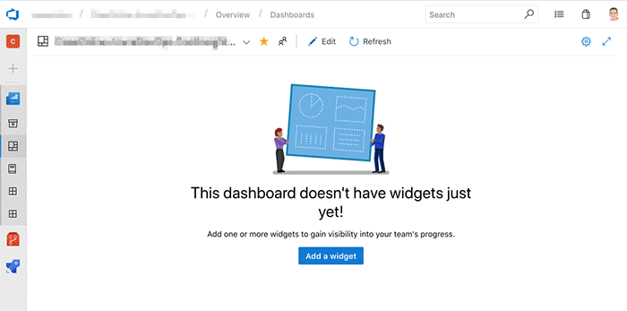
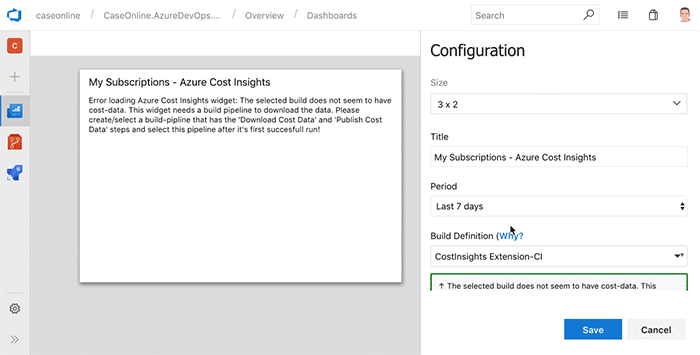
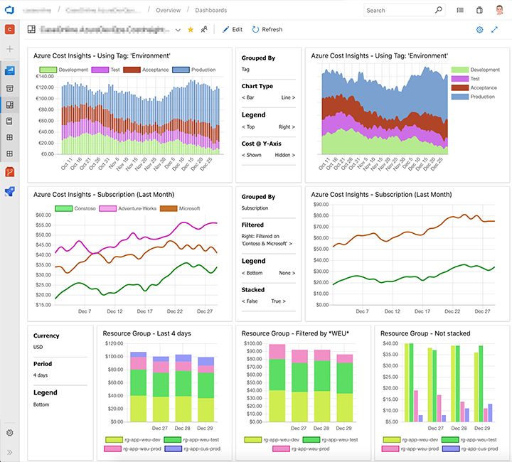

# Azure Cost Insights

Get in control over your Azure Costs! This Widget gives you insights in your teams' infrastructure spendings. Add the widget to your dashboard and detect anomolies much quicker. 

## Key Features

- Visualize cost data by Resouce Group, Resouce Type, Subscription or Tag
- Fully customizable: char & line chart-types, stacked & non-stacked, any timespan
- Filter by subscription and then/or by the name of Resource Group, Resource Type or by the value of the selected Tag (using glob patterns)
- No external service, data stay's within your Azure DevOps tenant
- Leverages your Azure Service Connections for downloading your data
- 1 widget for free, additional widget-instances starting at 1$ per widget per month (in-app purchase)

## Getting started
 
1. **Create the build pipeline** 
This build pipeline is required to download and host your cost data.

    - Create a new empty build (not release) pipeline and select a (preferable empty) repository
    - Name the pipeline something like 'Cost Insights'
    - Add the 'Download Cost Data' task for each subscription, then end with the 'Publish Cost Data' task 
    - Your pipeline will look like this:
    

2. **Queue the build** and wait for it to finish before continuing with step 3
    - While waiting, check the tips below

3. **Add the Widget to your Dashboard** 
    Each team can have their own widget, one or more per dashboard.
    
  
    Configure the widget to use the Build Pipeline created in step 1.
    
    Then configure it like you like.

## Tips

- In the trigger's tab, disable the 'continuous' trigger and set a scheduled trigger, for example every night at 04:00 AM.
- When the costs of the added subscriptions are 'high': extend the maximum duration of your build in the 'options' tab (±30 minutes per 100.000 $)
- Observe the artifacts of the build, this is the data that will be used by the widget

## Examples

## One widget for free!

// todo: warn about paid

## Things I have to do before Prod

- Detailed getting started
- Move the Marketplace stuff out of the code repo
- Parallelize the download
- Link 'Why'
- Public Dashboard
- Video
- Examples
- Explain the pricing
- Setup prod env.
- Test TFS
- Test different browsers
- Test different build hosts